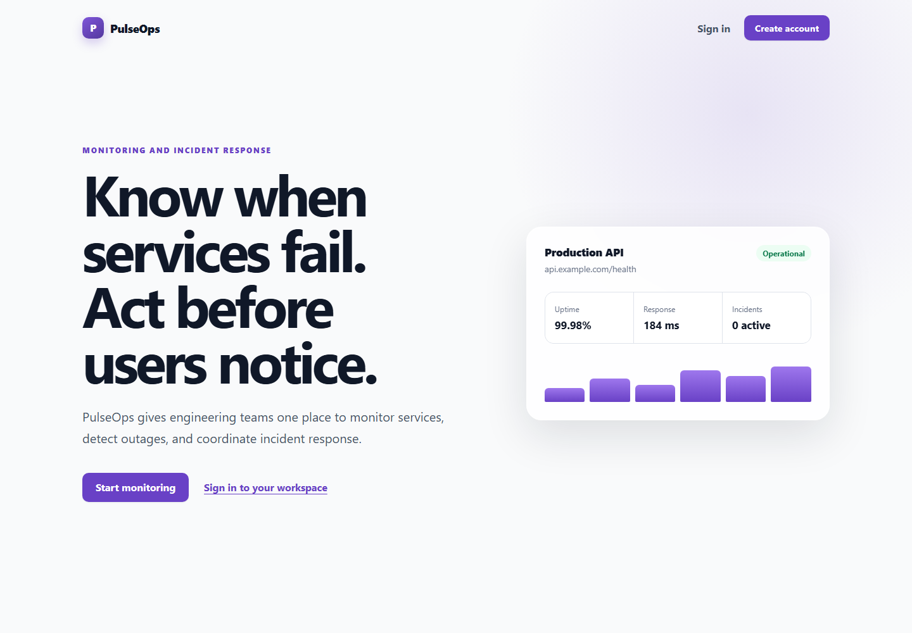
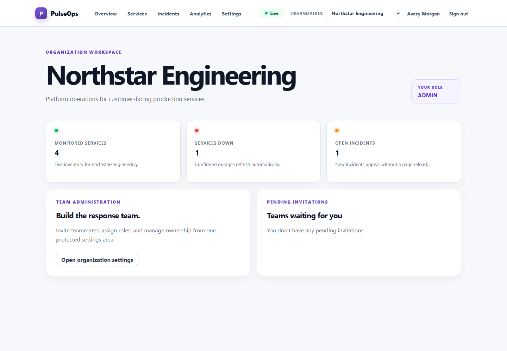
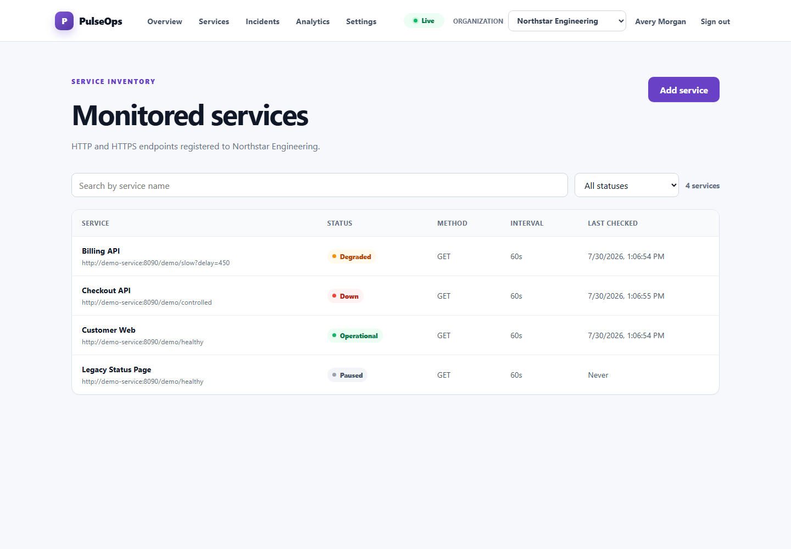
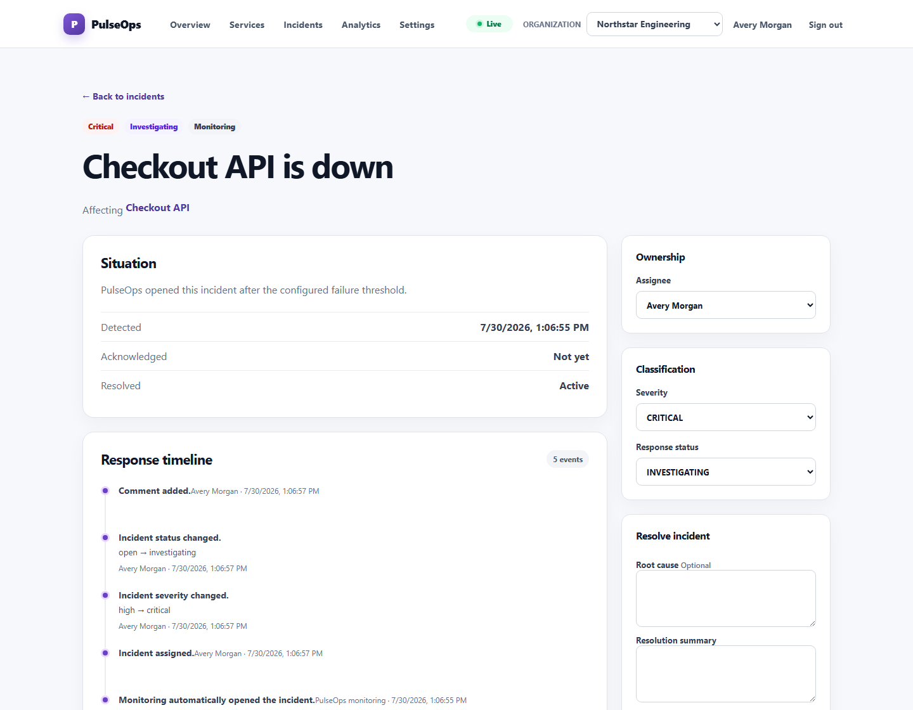
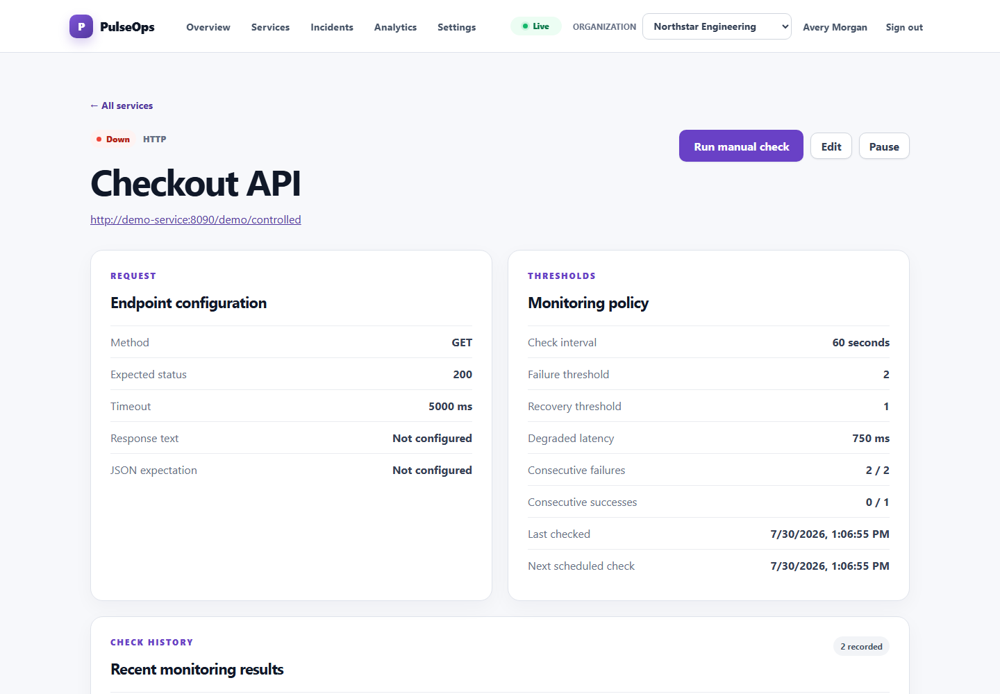
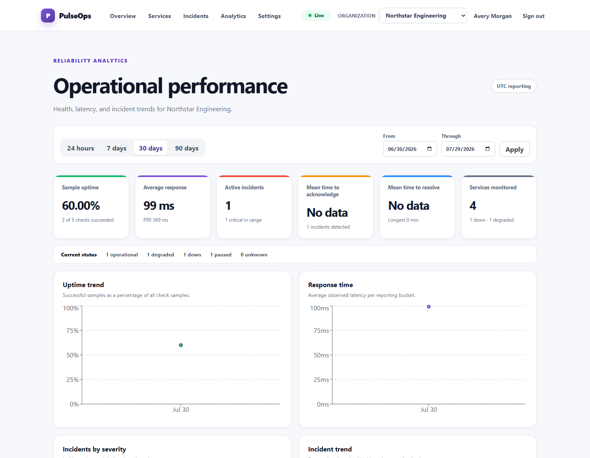
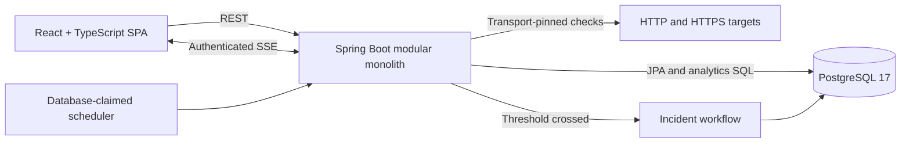

# PulseOps

**Production-style service monitoring and incident response for engineering
teams.**

PulseOps registers HTTP and HTTPS endpoints, performs bounded scheduled health
checks, confirms repeated failures, opens duplicate-safe incidents, streams
live updates, and reports sampled reliability metrics.



> **Portfolio status:** The monitoring and incident-response MVP, automated
> tests, production containers, Terraform infrastructure, and deployment
> workflow are implemented. The AWS target has been validated as code but has
> not been applied to a public environment. Notification delivery remains
> intentionally out of scope.

[Product screenshots](docs/screenshots.md) ·
[Architecture](docs/architecture.md) ·
[API](docs/api.md) ·
[Testing](docs/testing.md) ·
[AWS deployment](docs/deployment.md) ·
[Demo video script](docs/demo-video.md) ·
[Resume and LinkedIn copy](docs/portfolio-copy.md)

## What PulseOps demonstrates

PulseOps is built as a realistic product rather than a CRUD demonstration. Its
core workflow crosses authentication, tenant authorization, outbound networking,
scheduled concurrency, transactional state transitions, real-time delivery,
analytics, testing, containerization, and cloud infrastructure.

1. A user registers and creates or joins an organization.
2. An administrator configures an HTTP or HTTPS service and its expectations.
3. A database-claimed worker runs scheduled checks without overlapping work.
4. Failure and recovery thresholds protect against one-sample status changes.
5. A confirmed outage opens one automatic incident for the active outage.
6. Responders assign, investigate, comment, document, resolve, and reopen.
7. Authenticated SSE events refresh organization-scoped client data after commit.
8. PostgreSQL aggregates sampled uptime, latency, and incident performance.

## Product walkthrough



The synthetic portfolio workspace contains four services so each supported
state is visible.

| Service monitoring | Incident response |
|---|---|
|  |  |

| Health-check history | Reliability analytics |
|---|---|
|  |  |

See [all screenshots and captions](docs/screenshots.md), including the responsive
mobile workspace. Every image is captured from the real application against an
isolated PostgreSQL database, not from a mockup.

## Architecture



The application is a modular monolith: domain boundaries stay explicit without
adding network calls or distributed transactions before the product needs them.
PostgreSQL is the source of truth, including scheduled-work claims and
cross-module consistency.

The production target places an ACM-backed Application Load Balancer in public
subnets and the frontend, backend, migration task, and RDS database in private
or isolated subnets. GitHub Actions assumes a repository-scoped AWS role through
OIDC, pushes immutable images to ECR, runs Flyway, and updates ECS services only
after migration succeeds.

See [the architecture narrative and AWS topology](docs/architecture.md).

## Engineering decisions

| Area | Design |
|---|---|
| **Tenant security** | Every organization-scoped backend operation resolves an active membership and enforces `ADMIN`, `ENGINEER`, or `VIEWER`; the UI is not the security boundary. |
| **Authentication** | BCrypt passwords, short-lived JWT access tokens, hashed rotating refresh-token families, replay response, secure cookie support, and bounded privacy-preserving rate limits. |
| **SSRF defense** | URL policy validation, redirect rejection, private/reserved address blocking, DNS validation, transport-level address pinning, finite timeouts, and bounded response bodies. |
| **Scheduler safety** | PostgreSQL row locks with `SKIP LOCKED`, bounded batches, expiring claim leases, network I/O outside long transactions, and optimistic status updates. |
| **Outage behavior** | Separate failure and recovery thresholds, atomic status transitions, and a partial unique index preventing duplicate unresolved automatic incidents. |
| **Live data** | Organization-scoped SSE messages publish after commit and invalidate TanStack Query state; events are hints, never a second source of truth. |
| **Analytics** | Read-only PostgreSQL aggregation produces sampled uptime, P50/P95 latency, incident timing, time-series buckets, and per-service comparisons. |
| **Release safety** | Non-root read-only containers, Secrets Manager injection, Flyway as a one-off task, immutable ECR tags, ECS health checks, deployment circuit breakers, and GitHub OIDC. |

## Technology

| Layer | Technologies |
|---|---|
| Frontend | React 19, TypeScript 6, Vite 8, React Router, TanStack Query, Recharts, standard CSS |
| Backend | Java 21, Spring Boot 4.1, Spring MVC, Spring Security, Spring Data JPA, Bean Validation, Actuator, Springdoc |
| Data | PostgreSQL 17, Flyway 12 |
| Testing | JUnit 5, Spring Boot Test, Mockito, Testcontainers, Vitest, React Testing Library, Playwright, SpotBugs |
| Local runtime | Docker, Docker Compose, Nginx, deterministic demo service |
| Delivery target | GitHub Actions, Terraform, AWS ECS Fargate, RDS, ALB, ACM, Route 53, ECR, Secrets Manager, CloudWatch, S3 |

## Run locally

### Prerequisites

- Git
- Java 21
- Node.js 24 and npm 11
- Docker Desktop using Linux containers

Maven does not need a global installation; the repository includes the Maven
wrapper.

### Start the stack

Run from Windows PowerShell:

```powershell
Set-Location -LiteralPath 'D:\Code\vibing\pulseops'
powershell.exe -NoProfile -ExecutionPolicy Bypass `
  -File '.\scripts\setup.ps1'
docker compose up --build
```

The setup script creates an ignored `.env` with an independently generated
database password and 256-bit JWT key.

Once health checks pass:

- Application: <http://localhost:5173>
- Backend health: <http://localhost:8080/actuator/health>
- Swagger UI: <http://localhost:8080/swagger-ui.html>
- OpenAPI JSON: <http://localhost:8080/v3/api-docs>

Stop without deleting local database data:

```powershell
docker compose down
```

Use `docker compose down --volumes` only when a clean local database is
intentional.

## Run the deterministic portfolio demo

The portfolio script creates synthetic monitoring history and leaves an
isolated environment ready for a walkthrough:

```powershell
powershell.exe -NoProfile -ExecutionPolicy Bypass `
  -File '.\scripts\capture-portfolio.ps1' `
  -KeepRunning
```

Open <http://127.0.0.1:5280>. Credentials and the recording sequence are in the
[demo video package](docs/demo-video.md).

Stop and delete its disposable database:

```powershell
powershell.exe -NoProfile -ExecutionPolicy Bypass `
  -File '.\scripts\capture-portfolio.ps1' `
  -Stop
```

## Verification

Run the complete local quality gate:

```powershell
powershell.exe -NoProfile -ExecutionPolicy Bypass `
  -File '.\scripts\verify.ps1'
```

It performs:

- tracked-file secret scanning;
- 87 backend unit and PostgreSQL integration tests;
- SpotBugs static analysis;
- frontend dependency installation and linting;
- 20 Vitest and React Testing Library tests;
- TypeScript and Vite production builds; and
- Docker Compose configuration validation.

Run the isolated registration-to-resolution browser journey:

```powershell
powershell.exe -NoProfile -ExecutionPolicy Bypass `
  -File '.\scripts\e2e.ps1'
```

Run the bounded load smoke against a running backend:

```powershell
node '.\scripts\load-test.mjs'
```

The repository also contains independent backend, frontend, container,
infrastructure, E2E, and security GitHub Actions workflows. See
[docs/testing.md](docs/testing.md) for test boundaries and load-gate semantics.

## Production deployment target

Terraform defines:

- a two-availability-zone VPC with public, private application, and isolated
  database subnets;
- private ECS Fargate frontend, backend, and Flyway tasks;
- encrypted RDS PostgreSQL with backups and deletion protection;
- ACM HTTPS, Route 53 DNS, ALB path routing, and HTTP redirection;
- immutable, scan-on-push ECR repositories;
- Secrets Manager integration and production startup guards;
- structured CloudWatch logs, VPC flow logs, access logs, dashboard, SNS topic,
  and alarms; and
- a protected GitHub deployment role that accepts short-lived OIDC credentials.

The release workflow builds traceable images, requires a successful private
Flyway task, and then rolls the backend and frontend with ECS stability waits.

No live endpoint is advertised because applying these resources requires an AWS
account, public domain, and explicit cost approval. The complete bootstrap,
release, monitoring, rollback, and teardown procedure is documented in
[docs/deployment.md](docs/deployment.md).

## Repository map

```text
pulseops/
├── backend/                    Spring Boot modular monolith
├── frontend/                   React and TypeScript application
├── demo-service/               Deterministic health-check targets
├── infrastructure/terraform/  AWS production target
├── scripts/                    Setup, verification, E2E, load, migration,
│                               deployment, and portfolio automation
├── docs/                       Architecture, security, testing, operations,
│                               screenshots, demo, and portfolio copy
├── .github/workflows/          Independent CI and deployment workflows
└── docker-compose.yml          Health-gated local environment
```

## Documentation

| Topic | Document |
|---|---|
| Architecture and production topology | [docs/architecture.md](docs/architecture.md) |
| Database schema and migration rules | [docs/database.md](docs/database.md) |
| Authentication, authorization, SSRF, and threat boundaries | [docs/security.md](docs/security.md) |
| Monitoring scheduler and status transitions | [docs/monitoring-engine.md](docs/monitoring-engine.md) |
| Incident lifecycle | [docs/incidents.md](docs/incidents.md) |
| Analytics definitions and assumptions | [docs/analytics.md](docs/analytics.md) |
| SSE delivery contract | [docs/live-events.md](docs/live-events.md) |
| Test strategy and commands | [docs/testing.md](docs/testing.md) |
| AWS operations runbook | [docs/deployment.md](docs/deployment.md) |
| Product screenshot gallery | [docs/screenshots.md](docs/screenshots.md) |
| Demo narration and recording checklist | [docs/demo-video.md](docs/demo-video.md) |
| Resume bullets and LinkedIn copy | [docs/portfolio-copy.md](docs/portfolio-copy.md) |

## Deliberate limitations

- Email and in-app notification delivery are not implemented.
- Password-reset and email-verification delivery are future work.
- Invitation delivery is not emailed; matching registered users can discover
  pending invitations in the application.
- HTTP and HTTPS monitoring are implemented; TCP and synthetic login checks are
  future service types.
- SSE subscribers and authentication rate limits are in memory, so the
  production backend remains one task until those states move to shared
  infrastructure.
- Scheduled checks are sequential inside each bounded claimed batch. The claim
  design supports multiple workers, but a larger worker pool should follow
  measurement.
- Uptime is an observation-based estimate from persisted checks, not continuous
  SLA availability.
- The AWS infrastructure and release pipeline are implemented and validated as
  code but have not been applied to a public account.

## Contributing and license

See [CONTRIBUTING.md](CONTRIBUTING.md) for branch, commit, test, and review
expectations.

PulseOps is available under the [MIT License](LICENSE).
