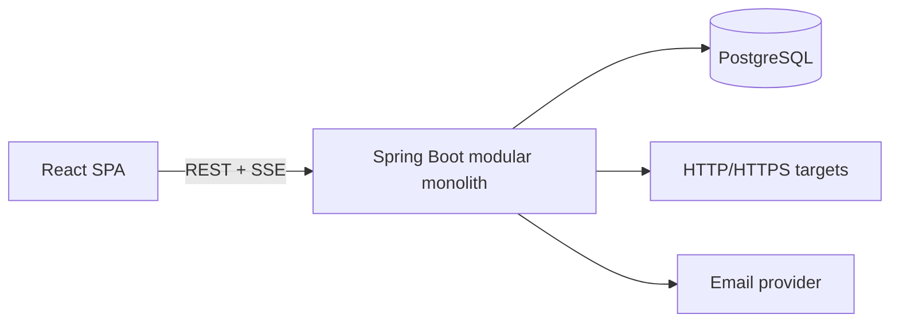

# PulseOps

PulseOps is a cloud-based service monitoring and incident-management platform
that checks application health, detects confirmed outages, alerts engineering
teams, and tracks incidents through resolution.

> Project status: Phase 4 (Service Management) is implemented. Scheduled
> monitoring, incidents, notifications, and analytics remain planned milestones
> and are not represented as completed features.

## Architecture



The application starts as a modular monolith. Domain modules will share one
deployment and database while keeping clear package and service boundaries.
This avoids distributed-system overhead before the product requires it.

See [docs/architecture.md](docs/architecture.md) for module boundaries and
runtime flows, and [docs/services.md](docs/services.md) for the Phase 4 service
lifecycle and authorization model.

## Technology stack

- Backend: Java 21, Spring Boot 4.1, Spring MVC, Spring Data JPA, Spring
  Security, Flyway, Actuator, Springdoc OpenAPI
- Frontend: React 19, TypeScript, Vite, React Router, TanStack Query, Recharts
- Database: PostgreSQL 17
- Testing: JUnit, Spring Boot Test, Testcontainers, Vitest, React Testing
  Library
- Infrastructure: Docker, Docker Compose, GitHub Actions
- Production target: Vercel, AWS ECS Fargate, and AWS RDS PostgreSQL

## Implemented capabilities

- Java and Node applications with reproducible dependency wrappers/lockfiles
- PostgreSQL configuration through environment variables
- Flyway-controlled schema history
- PostgreSQL-backed integration testing with Testcontainers
- Frontend unit test, type check, linter, and production build
- OpenAPI JSON and Swagger UI
- Health, readiness, and liveness endpoints
- Multi-stage, non-root application containers
- One-command local stack with health-gated startup
- User registration and login with normalized email addresses
- BCrypt password hashes and account status enforcement
- Short-lived JWT access tokens with issuer and audience validation
- Hashed, rotating refresh-token families with replay detection and revocation
- HttpOnly, SameSite refresh cookies and in-memory frontend access tokens
- Protected React routes, session restoration, and logout
- Stable API error envelopes with safe authentication messages
- Organization creation, discovery, settings, and persistent workspace switching
- Active memberships with `ADMIN`, `ENGINEER`, and `VIEWER` roles
- Backend-enforced tenant isolation and role authorization
- Hashed organization invitation tokens with email-bound acceptance
- Member role changes, removal, leave, and ownership-transfer workflows
- Responsive organization onboarding and team administration UI
- Organization-scoped HTTP/HTTPS service creation, editing, filtering,
  pausing, resuming, and soft deletion
- Role-aware service inventory, configuration form, and service details UI
- Bounded on-demand HTTP checks with status, text, JSON, and latency validation
- URL validation and private/reserved target blocking by default

## Planned MVP

The remaining MVP will add scheduled service checks, threshold-based outage
detection, incident workflows, in-app notifications, server-sent events, and
basic reliability analytics. See
[docs/api.md](docs/api.md) and
[docs/monitoring-engine.md](docs/monitoring-engine.md).

## Prerequisites

- Git
- Java 21
- Node.js 24 and npm 11
- Docker Desktop with Linux containers

Maven does not need to be installed globally. The repository includes
`backend\mvnw.cmd`.

## Local setup

Run from `D:\Code\vibing\pulseops` in Windows PowerShell:

```powershell
.\scripts\setup.ps1
docker compose up --build
```

When all health checks pass:

- Frontend: <http://localhost:5173>
- Backend health: <http://localhost:8080/actuator/health>
- Swagger UI: <http://localhost:8080/swagger-ui.html>
- OpenAPI JSON: <http://localhost:8080/v3/api-docs>

Stop the stack without deleting database data:

```powershell
docker compose down
```

Delete local database data only when a clean database is intentionally needed:

```powershell
docker compose down --volumes
```

## Environment variables

| Variable | Local default | Purpose |
|---|---|---|
| `POSTGRES_DB` | `pulseops` | Local database name |
| `POSTGRES_USER` | `pulseops` | Local database user |
| `POSTGRES_PASSWORD` | `pulseops` | Local-only database password |
| `POSTGRES_PORT` | `5432` | Host PostgreSQL port |
| `BACKEND_PORT` | `8080` | Host backend port |
| `FRONTEND_PORT` | `5173` | Host frontend port |
| `DATABASE_URL` | local JDBC URL | Direct backend JDBC URL |
| `DATABASE_USERNAME` | `pulseops` | Direct backend database user |
| `DATABASE_PASSWORD` | `pulseops` | Direct backend database password |
| `JWT_SECRET` | none; required | Base64-encoded signing key of at least 256 bits |
| `JWT_ISSUER` | `pulseops` | Required JWT issuer |
| `JWT_AUDIENCE` | `pulseops-web` | Required JWT audience |
| `JWT_ACCESS_TOKEN_TTL` | `15m` | Access-token lifetime |
| `JWT_REFRESH_TOKEN_TTL` | `30d` | Refresh-session lifetime |
| `REFRESH_COOKIE_SECURE` | `false` in Compose | Require HTTPS for refresh cookie |
| `CORS_ALLOWED_ORIGINS` | `http://localhost:5173` | Credentialed browser origins |
| `MONITORING_ALLOW_PRIVATE_TARGETS` | `true` in local Compose; `false` otherwise | Allow checks to private network destinations |
| `MONITORING_MAX_RESPONSE_BYTES` | `65536` | Maximum response bytes read by a manual check |

The setup script creates an ignored `.env` and generates a 256-bit JWT key.
Production secrets must come from a managed secret store, never committed files.
Production must set `REFRESH_COOKIE_SECURE=true` and
`MONITORING_ALLOW_PRIVATE_TARGETS=false`. Local Compose deliberately enables
private targets so the backend container can check the frontend container.

## Run tests

Backend tests require Docker because Testcontainers starts PostgreSQL:

```powershell
Set-Location -LiteralPath 'D:\Code\vibing\pulseops\backend'
.\mvnw.cmd test
```

Frontend checks:

```powershell
Set-Location -LiteralPath 'D:\Code\vibing\pulseops\frontend'
npm.cmd ci
npm.cmd run lint
npm.cmd test
npm.cmd run build
```

Run the combined verification:

```powershell
Set-Location -LiteralPath 'D:\Code\vibing\pulseops'
.\scripts\verify.ps1
```

## Database design

Flyway owns all schema changes. Hibernate validates mappings but never changes
the schema. Phase 4 adds UUID-backed monitored services, response expectations,
threshold configuration, lifecycle state, and check timestamps. See
[docs/database.md](docs/database.md).

## Security

Registration, login, refresh, and logout are public API operations. All other
application routes require a valid bearer JWT. Organization-scoped operations
also require an active membership and the appropriate role. The manual checker
rejects unsafe URL forms, disables redirects, validates resolved addresses,
limits time and response size, and blocks private/reserved targets by default.
See
[docs/security.md](docs/security.md).

## Deployment

The production target uses a Vercel-hosted SPA, an ECS Fargate backend, and RDS
PostgreSQL across private subnets. The current Docker Compose stack is intended
for development, not production. See [docs/deployment.md](docs/deployment.md).

## Screenshots and demo

Screenshots and a hosted demo are intentionally deferred until the MVP user
journey exists. Publishing scaffold screenshots would misrepresent project
progress.

## Known limitations

- Invitation email delivery is not implemented; matching registered users see
  pending invitations in the application.
- Password reset, email verification delivery, and authentication rate limiting
  are scheduled for later security/integration work.
- Default Compose credentials are for local development only.
- Email and live events are not implemented.
- Manual checks record their timestamps but intentionally do not alter
  threshold-based service status. Scheduled checks and check-result history
  arrive in Phase 5.
- TCP and JSON API service types are reserved for later phases; Phase 4 accepts
  HTTP and HTTPS services only.
- The current DNS preflight and HTTP connection are separate operations. Before
  accepting untrusted production targets, the checker must pin or revalidate
  the connected address to close the DNS-rebinding window.
- Uptime metrics will be sampled estimates, not continuous SLA measurements.
- npm currently reports a React Router advisory affecting RSC action handling.
  PulseOps is a client-only SPA and does not use RSC or server actions; the
  exception is tracked in [docs/security.md](docs/security.md).

## Contributing

Read [CONTRIBUTING.md](CONTRIBUTING.md). The project uses short-lived feature
branches and Conventional Commits.

## License

PulseOps is available under the [MIT License](LICENSE).
