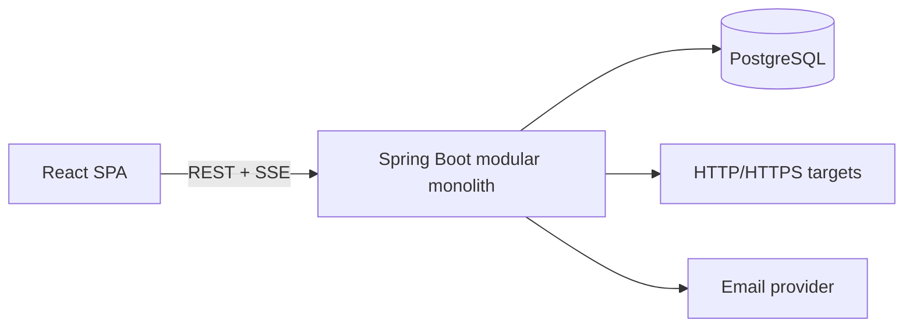

# PulseOps

PulseOps is a cloud-based service monitoring and incident-management platform
that checks application health, detects confirmed outages, alerts engineering
teams, and tracks incidents through resolution.

> Project status: Phase 1 (Project Foundation) is implemented. Authentication,
> organizations, monitoring, incidents, and analytics are planned milestones and
> are not represented as completed features.

## Architecture



The application starts as a modular monolith. Domain modules will share one
deployment and database while keeping clear package and service boundaries.
This avoids distributed-system overhead before the product requires it.

See [docs/architecture.md](docs/architecture.md) for module boundaries and
runtime flows.

## Technology stack

- Backend: Java 21, Spring Boot 4.1, Spring MVC, Spring Data JPA, Spring
  Security, Flyway, Actuator, Springdoc OpenAPI
- Frontend: React 19, TypeScript, Vite, React Router, TanStack Query, Recharts
- Database: PostgreSQL 17
- Testing: JUnit, Spring Boot Test, Testcontainers, Vitest, React Testing
  Library
- Infrastructure: Docker, Docker Compose, GitHub Actions
- Production target: Vercel, AWS ECS Fargate, and AWS RDS PostgreSQL

## Foundation capabilities

- Java and Node applications with reproducible dependency wrappers/lockfiles
- PostgreSQL configuration through environment variables
- Flyway-controlled schema history
- PostgreSQL-backed integration testing with Testcontainers
- Frontend unit test, type check, linter, and production build
- OpenAPI JSON and Swagger UI
- Health, readiness, and liveness endpoints
- Multi-stage, non-root application containers
- One-command local stack with health-gated startup

## Planned MVP

The MVP will add registration and JWT sessions, organizations and roles,
HTTP/HTTPS service monitoring, threshold-based outage detection, incident
workflows, in-app notifications, server-sent events, and basic reliability
analytics. See [docs/api.md](docs/api.md) and
[docs/monitoring-engine.md](docs/monitoring-engine.md).

## Prerequisites

- Git
- Java 21
- Node.js 24 and npm 11
- Docker Desktop with Linux containers

Maven does not need to be installed globally. The repository includes
`backend\mvnw.cmd`.

## Local setup

Run from `D:\Code\vibing\pulseops` in Windows PowerShell:

```powershell
Copy-Item -LiteralPath '.env.example' -Destination '.env'
docker compose up --build
```

When all health checks pass:

- Frontend: <http://localhost:5173>
- Backend health: <http://localhost:8080/actuator/health>
- Swagger UI: <http://localhost:8080/swagger-ui.html>
- OpenAPI JSON: <http://localhost:8080/v3/api-docs>

Stop the stack without deleting database data:

```powershell
docker compose down
```

Delete local database data only when a clean database is intentionally needed:

```powershell
docker compose down --volumes
```

## Environment variables

| Variable | Local default | Purpose |
|---|---|---|
| `POSTGRES_DB` | `pulseops` | Local database name |
| `POSTGRES_USER` | `pulseops` | Local database user |
| `POSTGRES_PASSWORD` | `pulseops` | Local-only database password |
| `POSTGRES_PORT` | `5432` | Host PostgreSQL port |
| `BACKEND_PORT` | `8080` | Host backend port |
| `FRONTEND_PORT` | `5173` | Host frontend port |
| `DATABASE_URL` | local JDBC URL | Direct backend JDBC URL |
| `DATABASE_USERNAME` | `pulseops` | Direct backend database user |
| `DATABASE_PASSWORD` | `pulseops` | Direct backend database password |

JWT, CORS, and email-provider variables will be introduced with the features
that consume them. Production secrets must come from a managed secret store,
never committed files.

## Run tests

Backend tests require Docker because Testcontainers starts PostgreSQL:

```powershell
Set-Location -LiteralPath 'D:\Code\vibing\pulseops\backend'
.\mvnw.cmd test
```

Frontend checks:

```powershell
Set-Location -LiteralPath 'D:\Code\vibing\pulseops\frontend'
npm.cmd ci
npm.cmd run lint
npm.cmd test
npm.cmd run build
```

Run the combined foundation verification:

```powershell
Set-Location -LiteralPath 'D:\Code\vibing\pulseops'
.\scripts\verify.ps1
```

## Database design

Flyway owns all schema changes. Hibernate validates mappings but never changes
the schema. UUID domain tables will be introduced alongside their features.
See [docs/database.md](docs/database.md).

## Security

The foundation exposes only health and API-documentation endpoints. All future
application routes are denied until Phase 2 introduces JWT authentication.
The monitoring client will require explicit SSRF defenses before accepting
user-controlled URLs. See [docs/security.md](docs/security.md).

## Deployment

The production target uses a Vercel-hosted SPA, an ECS Fargate backend, and RDS
PostgreSQL across private subnets. The current Docker Compose stack is intended
for development, not production. See [docs/deployment.md](docs/deployment.md).

## Screenshots and demo

Screenshots and a hosted demo are intentionally deferred until the MVP user
journey exists. Publishing scaffold screenshots would misrepresent project
progress.

## Known limitations

- The foundation does not yet expose product APIs.
- Default Compose credentials are for local development only.
- Email and live events are not implemented.
- Uptime metrics will be sampled estimates, not continuous SLA measurements.
- npm currently reports a React Router advisory affecting RSC action handling.
  PulseOps is a client-only SPA and does not use RSC or server actions; the
  exception is tracked in [docs/security.md](docs/security.md).

## Contributing

Read [CONTRIBUTING.md](CONTRIBUTING.md). The project uses short-lived feature
branches and Conventional Commits.

## License

PulseOps is available under the [MIT License](LICENSE).
