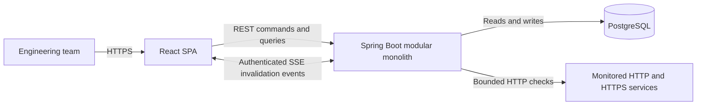
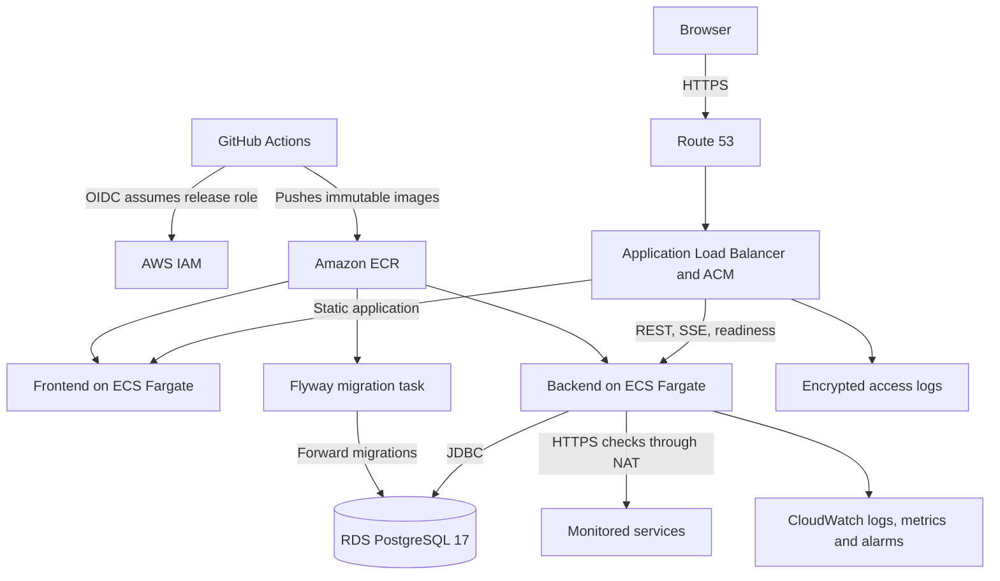

# Architecture

## Context

PulseOps monitors user-configured HTTP/HTTPS services and coordinates the
incident response that follows a confirmed outage. It is multi-tenant:
organizations own services, incidents, memberships, and analytics.

## Modular monolith

The first production version is one Spring Boot deployment organized into:

- `auth` and `user`
- `organization`, `membership`, and `invitation`
- `monitoredservice`
- `healthcheck`
- `incident`
- `analytics`
- `liveevent`
- `common` and `config`

Modules may call another module's application service or publish an internal
domain event. They should not reach directly into another module's repository.
This preserves boundaries without network calls or distributed transactions.

## Runtime responsibilities

The React SPA issues versioned REST commands and queries. An authenticated
server-sent event stream notifies the client that organization-scoped data
changed; TanStack Query then refreshes authoritative state. Events are
invalidation hints rather than a second source of truth.

PostgreSQL is the system of record. Flyway owns schema changes. The monitoring
scheduler claims due service rows in bounded batches, performs checks outside
long database transactions, and commits results through state-transition
services.

Phase 4 implements the `monitoredservice` module and the immediate HTTP checker.
Controllers handle organization-scoped DTOs; the application service enforces
membership, roles, lifecycle, and duplicate-name rules; the repository owns
tenant-filtered persistence; and the checker performs one bounded request.

Phase 5 adds the `healthcheck` module. A scheduler atomically claims a bounded
due batch with PostgreSQL row locks and `SKIP LOCKED`, then performs network I/O
outside database transactions. Completed results lock one service row, verify
scheduled claim ownership, persist history, update counters/status, set the next
due time, and release the claim in one transaction. Expired claims make
unfinished work eligible after a worker or application restart.

Phase 6 adds the `incident` module. An applied transition into `DOWN` opens one
automatic incident in the same completion transaction. Recovery moves that
incident to `MONITORING` and appends a recovery event without silently
resolving it. Manual and automatic incidents share the same tenant-safe
assignment, comments, lifecycle, resolution, and append-only timeline
services.

Phase 7 adds the `liveevent` module. Application services publish lightweight
organization events inside their transactions. A transaction listener
broadcasts only after commit, preventing clients from racing uncommitted data.
The in-memory stream registry isolates connections by organization, sends
heartbeats, and removes completed or failed emitters.

Phase 8 adds the `analytics` read module. It does not duplicate monitoring
history into reporting tables at the current scale. Bounded, read-only
PostgreSQL queries aggregate health-check and incident records into summary,
percentile, time-series, severity, and per-service DTOs. The SPA lazy-loads
Recharts only on the analytics route and TanStack Query refreshes the snapshot
after relevant live events.

Phase 9 hardens public boundaries. The checker rejects unsafe URL forms, pins a
validated DNS address to the outbound transport, disables redirects, limits
response size and time, and blocks private or reserved targets. Authentication
rate limits use bounded, privacy-preserving keys. Production startup validation
refuses insecure cookies, HTTP CORS origins, private targets, disabled limits,
published OpenAPI, or runtime schema migration.

## Authentication flow

The SPA sends credentials only to the authentication API. The backend verifies
BCrypt hashes and returns a signed, short-lived access JWT while setting an
opaque refresh token in an HttpOnly cookie. PostgreSQL stores only the refresh
token hash. Refresh requests rotate the opaque token; bearer JWTs authorize
protected API requests without server-side access-token sessions.

## Organization boundary

An organization is the tenant root. Creation atomically writes the organization
and an `ADMIN` membership for its owner. Every organization query first resolves
an active membership from the JWT subject; administrative commands then verify
the membership role. Ownership is an additional invariant for transfer and
leave operations, not a hidden fourth role.

The SPA loads all active memberships after authentication and stores only the
selected organization ID in local storage. Organization details and roles are
always refreshed from the API. Service queries accept the selected organization
as context and independently enforce the same backend membership boundary.
Incident, analytics, and live-event queries enforce that boundary as well;
future tenant-owned modules must do the same.

## Reliability boundaries

- Requests use correlation IDs.
- Health checks use finite connect/read timeouts and bounded response bodies.
- A database claim lease prevents overlapping checks and survives worker loss.
- Optimistic locking protects status counters.
- A partial unique index prevents duplicate active automatic incidents.
- Refresh tokens are hashed, rotated, and revoked as token families.
- Live events publish only after the surrounding database transaction commits.

## Production topology

The ALB is the only public compute entry point. Frontend and backend Fargate
tasks run without public IP addresses in two private application subnets. RDS
runs in isolated database subnets and accepts PostgreSQL only from the backend
security group. Outbound monitoring traffic crosses a NAT gateway and is
observable through VPC flow logs.

ACM terminates TLS at the ALB. HTTP redirects permanently to HTTPS. Listener
rules send `/api/*` and readiness requests to the backend; other paths reach
the Nginx-served SPA. The 75-second ALB idle timeout is longer than the
15-second SSE heartbeat.

The release workflow builds three immutable images, runs the Flyway task, and
updates the backend and frontend only after migration succeeds. ECS deployment
circuit breakers roll back unhealthy revisions. GitHub uses short-lived OIDC
credentials scoped to the protected `production` environment rather than a
stored AWS access key.

## Deliberate boundaries

- The backend remains one task because SSE subscribers and authentication rate
  limits are currently in memory. Shared pub/sub and rate-limit state are
  prerequisites for horizontal backend scaling.
- The scheduler already uses database claims that permit multiple workers, but
  checks run sequentially within each bounded batch until measurements justify
  a worker pool.
- Uptime is a sample-based estimate derived from recorded checks, not continuous
  SLA measurement.
- In-app and email notification delivery remain explicitly outside the current
  MVP.
