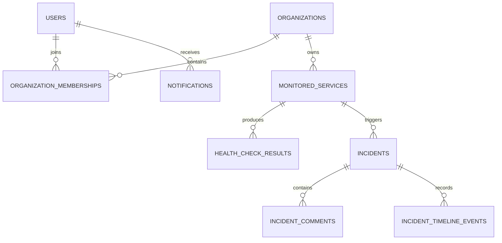

# Database

## Ownership

PostgreSQL is the source of truth. Flyway migrations under
`backend/src/main/resources/db/migration` own the schema. Hibernate uses
`ddl-auto: validate`; it must never create or update production tables.

## Planned relationships

The detailed columns are introduced with their owning feature. UUIDs are
application-generated. Every tenant-owned table carries an organization
reference where doing so strengthens authorization and integrity.

## Migration rules

- Never edit a migration after it has been merged and applied.
- Add a new forward migration for every schema change.
- Use explicit constraints and indexes.
- Avoid long table rewrites in production migrations.
- Test migrations against PostgreSQL through Testcontainers.
- Name migrations `V<version>__<description>.sql`.

The foundation migration establishes a real Flyway baseline without creating
feature tables ahead of their domain implementation.
