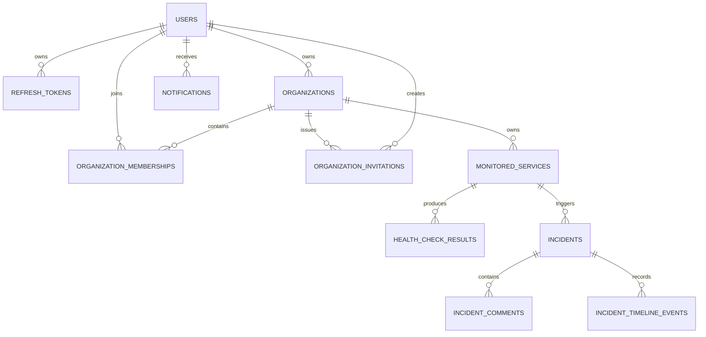

# Database

## Ownership

PostgreSQL is the source of truth. Flyway migrations under
`backend/src/main/resources/db/migration` own the schema. Hibernate uses
`ddl-auto: validate`; it must never create or update production tables.

## Relationships

Phase 2 introduces `users` and `refresh_tokens`. User emails are normalized and
unique. Passwords are stored only as BCrypt hashes. Refresh-token values are
represented only by unique SHA-256 hashes, with family IDs supporting rotation,
revocation, and replay response.

Phase 3 introduces:

- `organizations`, with a globally unique normalized slug and explicit owner;
- `organization_memberships`, with one durable row per organization/user pair,
  active/left/removed lifecycle state, role constraints, and lookup indexes;
- `organization_invitations`, with normalized email, expiry, creator, accepted
  timestamp, and only a unique SHA-256 token hash.

Creating an organization and its owner membership is one transaction.
Invitation acceptance locks the invitation row and membership row, preventing
two requests from creating duplicate memberships. A previously left or removed
membership is reactivated rather than duplicated. Ownership can point only to a
user, while the application transaction guarantees the owner also has an
active `ADMIN` membership.

The remaining detailed columns are introduced with their owning feature. UUIDs
are application-generated. Every tenant-owned table carries an organization
reference where doing so strengthens authorization and integrity.

## Migration rules

- Never edit a migration after it has been merged and applied.
- Add a new forward migration for every schema change.
- Use explicit constraints and indexes.
- Avoid long table rewrites in production migrations.
- Test migrations against PostgreSQL through Testcontainers.
- Name migrations `V<version>__<description>.sql`.

`V1` establishes the Flyway baseline. `V2` creates authentication tables.
`V3` creates organization, membership, and invitation tables with foreign keys,
checks, uniqueness guarantees, and tenant lookup indexes.
