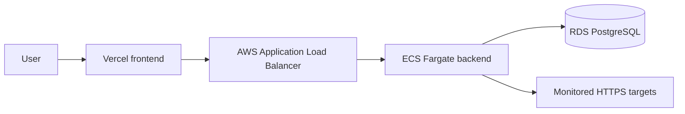

# Deployment

## Local

Docker Compose runs PostgreSQL, the Spring Boot backend, and an Nginx-served
frontend. Services start only after their dependencies report healthy.
Application images run as non-root users.

## Production target

ECS tasks and RDS reside in private subnets. Only the load balancer is public.
Security groups allow ALB-to-ECS and ECS-to-RDS traffic. Backend egress is
restricted and observed because monitoring requires outbound HTTP/HTTPS.

Production needs TLS, automated Flyway execution, managed secrets, RDS backups,
multi-AZ where budget permits, task autoscaling, log retention, and rollback
procedures. `JWT_SECRET` must come from AWS Secrets Manager or an equivalent
managed store, and `REFRESH_COOKIE_SECURE` must be enabled. Deployment must
never proceed after failed tests.
