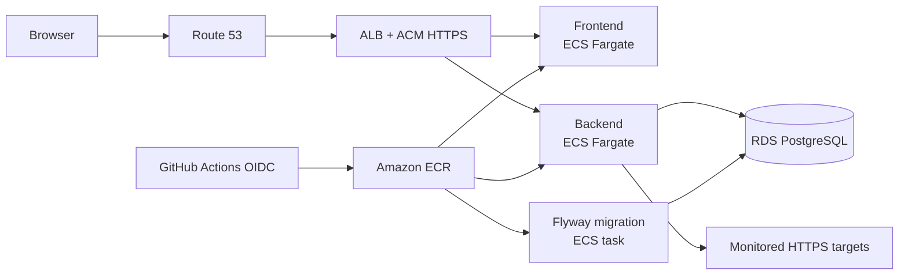

# Production deployment

PulseOps deploys as three immutable images on AWS:

- an Nginx frontend service on ECS Fargate;
- a Spring Boot backend service on ECS Fargate; and
- a one-off Flyway migration task that must succeed before either service is
  updated.

An internet-facing Application Load Balancer terminates TLS, redirects HTTP to
HTTPS, sends `/api/*` and readiness traffic to the backend, and sends all other
traffic to the React application. Fargate tasks and PostgreSQL run in private
subnets without public IP addresses.



## What Terraform creates

The configuration in `infrastructure/terraform` creates:

- one VPC across two availability zones;
- public load-balancer subnets, private application subnets, and isolated
  database subnets;
- one cost-aware NAT gateway by default, configurable to two;
- three immutable, scan-on-push ECR repositories;
- an ECS cluster, task definitions, services, log groups, and least-privilege
  task roles;
- an encrypted RDS PostgreSQL 17 instance with backups, enhanced monitoring,
  Performance Insights, and an RDS-managed password;
- an ACM certificate, Route 53 validation records, an HTTPS listener, and an
  application DNS alias;
- encrypted, expiring ALB access logs in S3;
- VPC flow logs, an SNS alarm topic, five CloudWatch alarms, and a dashboard;
  and
- a repository- and environment-scoped GitHub Actions deployment role.

The default sizing is suitable for a portfolio environment, not a high
availability service. Set `nat_gateway_count = 2`, `database_multi_az = true`,
and higher ECS desired counts only after the application components that store
state in memory have been moved to shared storage.

## Prerequisites

Before applying the stack, prepare:

1. An AWS account and an AWS CLI profile with permission to create the declared
   resources.
2. Terraform 1.10 or newer.
3. A public Route 53 hosted zone and the DNS name to use for PulseOps.
4. A Secrets Manager secret whose value is a Base64-encoded random key of at
   least 256 bits.
5. The account-level GitHub Actions OIDC provider for
   `https://token.actions.githubusercontent.com`, with audience
   `sts.amazonaws.com`.
6. An S3 state bucket with versioning, encryption, public access blocking, and
   a bucket policy restricted to the infrastructure operators. Terraform's S3
   `use_lockfile` backend option provides state locking.

Creating AWS resources incurs charges. Review the Terraform plan and current
AWS pricing before applying it.

## Configure Terraform

Run these commands from Windows PowerShell:

```powershell
Set-Location -LiteralPath 'D:\Code\vibing\pulseops\infrastructure\terraform'
Copy-Item -LiteralPath '.\terraform.tfvars.example' -Destination '.\terraform.tfvars'
notepad.exe '.\terraform.tfvars'
```

Replace every example value. Keep `terraform.tfvars` local; it is ignored by
Git. The OIDC trust policy accepts only this subject:

```text
repo:<owner>/<repository>:environment:production
```

Initialize the remote state backend:

```powershell
terraform.exe init `
  -backend-config='bucket=<state-bucket>' `
  -backend-config='key=pulseops/production.tfstate' `
  -backend-config='region=<aws-region>' `
  -backend-config='use_lockfile=true'
```

Format, validate, and inspect a saved plan:

```powershell
terraform.exe fmt -check -recursive
terraform.exe validate
terraform.exe plan -out='pulseops-production.tfplan'
terraform.exe show 'pulseops-production.tfplan'
```

Do not apply until the plan contains only the intended resources:

```powershell
terraform.exe apply 'pulseops-production.tfplan'
```

## First deployment bootstrap

ECS needs an existing image before it can start the first service tasks. Use
this order for a new account:

1. Apply only the ECR repositories and lifecycle policies.
2. Build and push the backend, production frontend, and migration images with
   the `bootstrap` tag.
3. Apply the complete Terraform plan.
4. Configure the protected GitHub environment described below.
5. Run the `Deploy Production` workflow to replace the bootstrap images with
   an immutable commit-based release.

The regular deployment workflow owns ECS task-definition revisions. Terraform
ignores later service task-definition changes so a routine infrastructure apply
does not roll a release backward. When Terraform changes a task definition,
the next release derives its revision from the latest family definition and
therefore includes the infrastructure update.

## Configure the GitHub production environment

Create an environment named exactly `production` in the GitHub repository.
Add required reviewers and prevent unreviewed branches from deploying. Add
these environment variables using values from `terraform output`:

| GitHub variable | Terraform value |
|---|---|
| `AWS_REGION` | configured AWS region |
| `AWS_ROLE_ARN` | `github_deployment_role_arn` |
| `ECR_BACKEND_REPOSITORY` | `ecr_repository_urls.backend` |
| `ECR_FRONTEND_REPOSITORY` | `ecr_repository_urls.frontend` |
| `ECR_MIGRATION_REPOSITORY` | `ecr_repository_urls.migration` |
| `ECS_CLUSTER` | `ecs_cluster_name` |
| `ECS_BACKEND_SERVICE` | `backend_service_name` |
| `ECS_FRONTEND_SERVICE` | `frontend_service_name` |
| `ECS_MIGRATION_TASK_DEFINITION` | `migration_task_definition_arn` |
| `ECS_MIGRATION_SUBNETS` | comma-separated `migration_subnet_ids` |
| `ECS_MIGRATION_SECURITY_GROUP` | `migration_security_group_id` |

No long-lived AWS access key belongs in GitHub. The workflow requests a
short-lived OIDC token and can assume only the Terraform-managed deployment
role.

## Release flow

Run `Deploy Production` from the GitHub Actions page. Leaving `image_tag`
empty uses the first 12 characters of the commit SHA. The workflow:

1. validates every required production environment value;
2. assumes the deployment role through OIDC;
3. builds and pushes three immutable, traceable images;
4. registers and runs a private migration task;
5. verifies that Flyway exited successfully;
6. registers a backend task revision and waits for a stable rollout; and
7. registers a frontend task revision and waits for a stable rollout.

The release stops before an application rollout if migration fails. ECS
deployment circuit breakers roll back unhealthy service tasks.

## HTTPS and runtime safety

ACM validates the certificate through Route 53. Port 80 performs only a
permanent redirect; application traffic uses the TLS 1.2/1.3 listener.
Production cookies are secure, CORS accepts only the public HTTPS origin,
OpenAPI is disabled, private monitoring targets are blocked, and runtime Flyway
migrations are disabled.

The production startup validator refuses to boot if any of those safety
controls are weakened. The ALB appends the connecting address to
`X-Forwarded-For`; only backend traffic from the load-balancer security group is
accepted, and the backend uses the rightmost forwarded address for auth rate
limits.

Server-sent event traffic follows the backend path directly through the ALB.
The load balancer allows a 75-second idle interval, while the backend emits a
keep-alive comment every 15 seconds, so a healthy live stream remains active
without an extra reverse-proxy buffering layer.

## Monitoring and operations

Application logs are structured for ECS and retained in CloudWatch for 30 days
by default. The dashboard shows ALB traffic and 5xx responses, backend p95
latency, ECS CPU and memory, and RDS health.

The SNS topic receives alarm and recovery events for:

- an unhealthy backend target;
- five backend 5xx responses within five minutes;
- backend CPU above 80% for 15 minutes;
- RDS CPU above 80% for 15 minutes; and
- RDS free storage below 2 GiB.

Subscribe an operator email or incident integration to `alarm_topic_arn`.
Confirm the subscription before relying on notifications.

Useful investigation commands:

```powershell
aws ecs describe-services `
  --cluster '<cluster>' `
  --services '<backend-service>' '<frontend-service>'

aws logs tail '/pulseops/production/backend' --since 30m --follow
aws cloudwatch describe-alarms --alarm-name-prefix 'pulseops-production'
```

Check after every deployment:

```powershell
Invoke-WebRequest -Uri 'https://<domain>/healthz'
Invoke-RestMethod -Uri 'https://<domain>/actuator/health/readiness'
```

Also complete one authenticated browser smoke test: log in, open an
organization, load services and incidents, and verify the live connection.

## Recovery and teardown

Do not rerun the build workflow with an existing tag: ECR rejects tag
replacement by design. To roll back, register a new task revision that
references the known-good image digest, update the affected ECS service, and
wait for stability. Record the incident and deploy a corrected forward release
through the normal workflow afterward.

The database and load balancer enable deletion protection by default. A planned
teardown requires an explicit reviewed change to disable those protections.
RDS takes a final snapshot and retains automated backups. Never bypass these
controls merely to make `terraform destroy` succeed.

## Current scaling boundary

The backend desired count is intentionally fixed at one. Live-event subscribers
and authentication rate-limit counters are stored in application memory.
Multiple backend tasks would produce inconsistent behavior until those states
move to a shared system such as Redis. The database claim lease already keeps
scheduled health checks safe across workers, but that alone does not remove the
live-event and rate-limit limitation.
