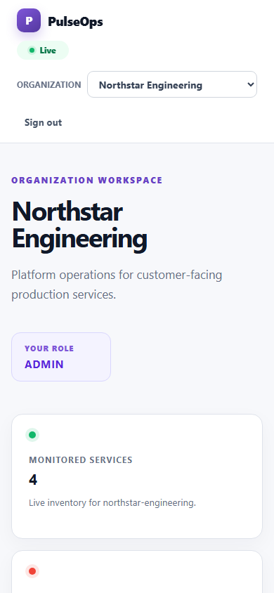

# Product screenshots

These images are captured from the real React and Spring Boot applications
against an isolated PostgreSQL database and the deterministic demo service.
They are not mockups. All people, organizations, endpoints, and incidents use
synthetic portfolio data.

## Dashboard


The organization dashboard summarizes monitored services, confirmed outages,
and active incidents while showing the signed-in member's role.

## Service inventory


The inventory presents operational, degraded, down, and paused endpoints in one
filterable workspace.

## Service details


Service details combine the current state, endpoint expectations, outage and
recovery thresholds, persisted health-check history, and related incidents.

## Incident response


The response workspace records severity, status, assignment, comments, and an
append-only event timeline for a monitoring-created incident.

## Reliability analytics


Analytics summarize sampled uptime, response latency, incident performance,
service status, time-series trends, and per-service comparisons.

## Responsive dashboard



The authenticated workspace adapts to a narrow mobile viewport without a
separate application.

## Reproduce the images

Start Docker Desktop, then run from the repository root:

```powershell
powershell.exe -NoProfile -ExecutionPolicy Bypass `
  -File '.\scripts\capture-portfolio.ps1'
```

Add `-InstallBrowsers` the first time if Playwright Chromium is not installed.
The script creates an isolated Compose project, seeds data through public user
flows, writes the PNG files, and removes its containers and database volume.
